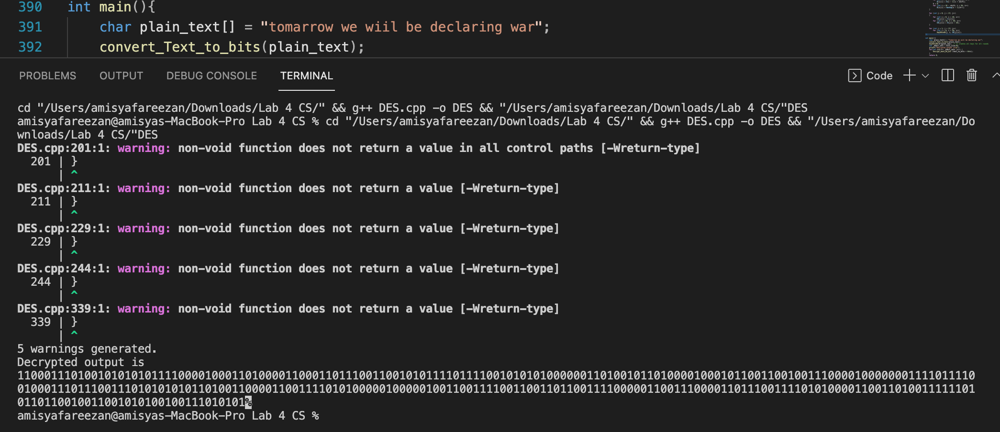
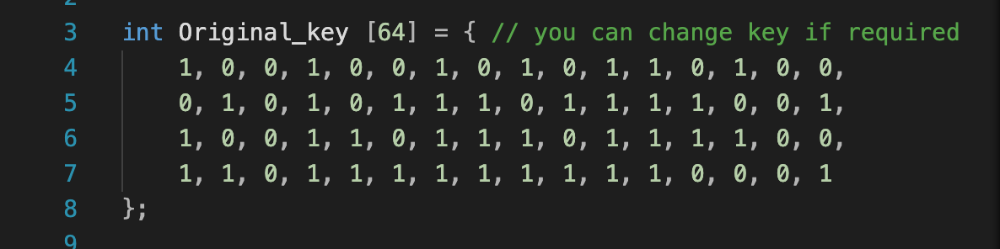
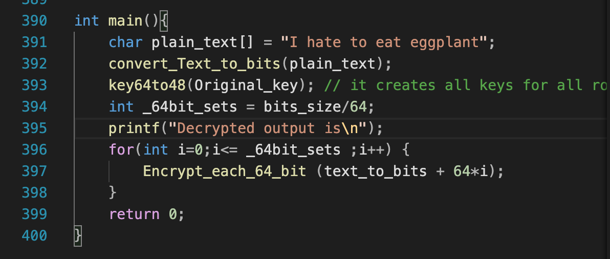
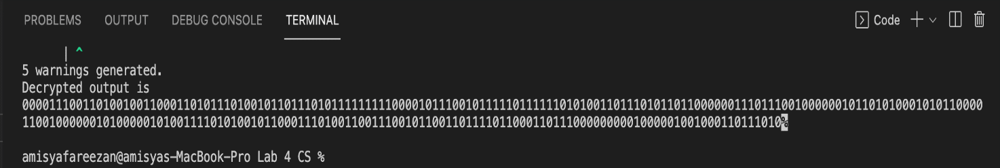
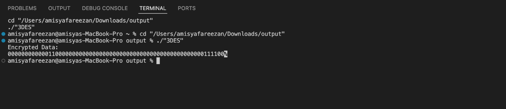
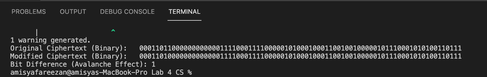

<!-- markdownlint-disable MD033 MD041 -->
<p align="center" width="100%">
    
</p>

# TEB2093 Computer Security - Lab 04

## Members

- Ammar Farhan Bin Mohamad Rizam (22006911)
- Muhammad Hanis Afifi Bin Azmi (22001602)
- Ahmad Anas Bin Azhar (22005996)
- Amisya Fareezan Binti Mohd Fadhil (22007082)

## Table of Contents

- [TEB2093 Computer Security - Lab 04](#teb2093-computer-security---lab-04)
  - [Members](#members)
  - [Table of Contents](#table-of-contents)
  - [Experiment 2: Understanding Data Encryption Standard (DES) Cipher](#experiment-2-understanding-data-encryption-standard-des-cipher)
  - [Experiment 3: Understanding Triple Data Encryption Standard (3DES) Cipher](#experiment-3-understanding-triple-data-encryption-standard-3des-cipher)
  - [Experiment 4: Understanding Weaknesses and Avalanche Effect of DES and 3DES](#experiment-4-understanding-weaknesses-and-avalanche-effect-of-des-and-3des)
    - [Weaknesses of DES](#weaknesses-of-des)
    - [Weaknesses of 3DES](#weaknesses-of-3des)
    - [Avalanche Effect](#avalanche-effect)
    - [Code Implementation](#code-implementation)

## Experiment 2: Understanding Data Encryption Standard (DES) Cipher

### Default Code Output




### Custom Key & Plaintext




### Output


### Understanding DES Analysis

DES incorporates cryptographic principles such as completeness and the avalanche effect but has notable weaknesses:
- Poor key selection can introduce vulnerabilities.
- The most effective attack remains exhaustive key search, proving its resilience over time.

## Experiment 3: Understanding Triple Data Encryption Standard (3DES) Cipher

### Plain Text Input

```
01101011 1100 01011001 00110100 11101100 01101000 11110011 10000101 1101
```

### Output



## Experiment 4: Understanding Weaknesses and Avalanche Effect of DES and 3DES

### Weaknesses of DES
- **Short Key Length:** Vulnerable to brute-force attacks with modern computing power.
- **Susceptibility to Cryptanalysis:** Prone to differential and linear cryptanalysis.
- **Outdated Design:** No longer meets modern cryptographic standards.
- **Weak and Semi-Weak Keys:** Certain key pairs produce predictable outputs.

### Weaknesses of 3DES
- **Performance Overhead:** Applying DES three times makes it slower.
- **Inherited DES Vulnerabilities:** Since 3DES is built on DES, it retains many weaknesses.
- **Reduced Effective Security:** Practical attacks reduce its security level to around 112 bits.
- **Deprecation:** Modern cryptographic standards recommend transitioning to AES.

### Avalanche Effect
- **High Diffusion Property:** Small changes in plaintext or key significantly alter ciphertext.
- **Amplified in 3DES:** Due to multiple encryption stages, 3DES enhances diffusion.
- **Limitations:** Does not mitigate the fundamental weaknesses of DES and 3DES.

### Code Implementation

```cpp
#include <iostream>
#include <bitset>
#include <string>

using namespace std;

string simpleEncryption(const string &plaintext, const string &key) {
    string ciphertext = plaintext;
    for (size_t i = 0; i < plaintext.size(); ++i) {
        ciphertext[i] ^= key[i % key.size()];
    }
    return ciphertext;
}

string tripleEncrypt(const string &plaintext, const string &key) {
    string stage1 = simpleEncryption(plaintext, key);
    string stage2 = simpleEncryption(stage1, key);
    return simpleEncryption(stage2, key);
}

string stringToBinary(const string &str) {
    string binary = "";
    for (char ch : str) {
        binary += bitset<8>(ch).to_string();
    }
    return binary;
}

int calculateBitDifference(const string &binary1, const string &binary2) {
    int diff = 0;
    for (size_t i = 0; i < binary1.size(); ++i) {
        if (binary1[i] != binary2[i]) {
            diff++;
        }
    }
    return diff;
}

int main() {
    string plaintext = "HelloWorld";
    string key = "SecretKey";
    
    string ciphertext = simpleEncryption(plaintext, key);
    string binaryCiphertext = stringToBinary(ciphertext);
    
    string tripleCiphertext = tripleEncrypt(plaintext, key);
    string binaryTripleCiphertext = stringToBinary(tripleCiphertext);
    
    string modifiedPlaintext = plaintext;
    modifiedPlaintext[0] ^= 1;
    
    string modifiedCiphertext = simpleEncryption(modifiedPlaintext, key);
    string binaryModifiedCiphertext = stringToBinary(modifiedCiphertext);
    
    string modifiedTripleCiphertext = tripleEncrypt(modifiedPlaintext, key);
    string binaryModifiedTripleCiphertext = stringToBinary(modifiedTripleCiphertext);
    
    int bitDifferenceSingle = calculateBitDifference(binaryCiphertext, binaryModifiedCiphertext);
    int bitDifferenceTriple = calculateBitDifference(binaryTripleCiphertext, binaryModifiedTripleCiphertext);
    
    cout << "=== Avalanche Effect Demonstration ===" << endl;
    cout << "Bit Difference (Single Encryption): " << bitDifferenceSingle << " bits\n" << endl;
    cout << "Bit Difference (Triple Encryption): " << bitDifferenceTriple << " bits\n" << endl;
    
    return 0;
}
```

### Output



### Avalanche Effect Analysis

The result of this code shows that a single-bit change in plaintext leads to a large number of bit differences in ciphertext. However, while the Avalanche Effect improves security, it does not fully mitigate cryptographic weaknesses such as weak key selection and performance overhead in 3DES.

